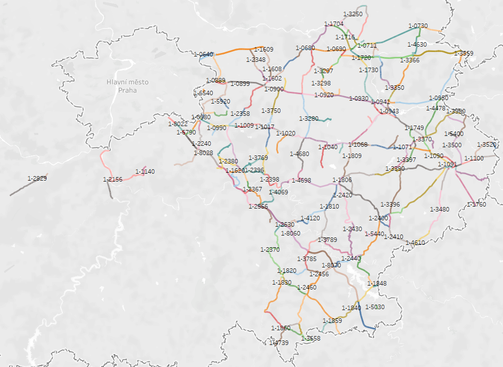

# Project "Relative Car Accident Rates in 2023 for the Central Bohemian Region" 
## Proof of Concept

| Preview             |
:-------------------------:|
  |

Information you will find here:
1. :globe_with_meridians:[Spatial map](Central_Bohemian_Region_WGS_84) of Central Bohemian Region[^1] in QGIS with use of OpenStreetMap
2. Direct link to realized solution in [Tableau Public](https://public.tableau.com/views/RelativeAccidentRateinCentralBohemianRegion/MainOverview?:language=en-US&:sid=39F22E03F39142BDA3BDE1D519610F27-0:0&:redirect=auth&:display_count=n&:origin=viz_share_link)

All the data were provided by [Czech Police](https://nehody.policie.cz/), [Transport Research Centre]() & [Directorate of Roads and Highways](https://scitani.rsd.cz/CSD_2020/pages/map/default.aspx).

All the tools used to realize [QGIS](https://www.qgis.org/), [OpenStreetMap](https://www.openstreetmap.org) & [Tableau Public Desktop](https://www.tableau.com/community/public)


The road segments where used to join various data and to be able to calculate e.g. Relative Accident Rate. In case you change a period in Tableau, all is recalculated dynamically.

All content is free to use for private usage, but if you use any part of this repository, please cite me accordingly:

```
@misc{zbj3ji,
    author = {Jan Zbirovsky},
    title = {{Relative Accident Rates in the Central Bohemian Region}},
    issue_date = {September 2024},
    howpublished = "\url{ https://github.com/zbj3ji/Relative-Car-Accident-Rates }",
    url = {{https://github.com/zbj3ji/Relative-Car-Accident-Rates}},
    year = {2024}
}
```
:star:**For commercial purpose please contact me directly via [LinkedIn](https://www.linkedin.com/in/jan-zbirovsky/)! or via [e-mail](mailto:zbirovsky@email.cz)**

[^1]: For primary, secondary and tertiary roads only
